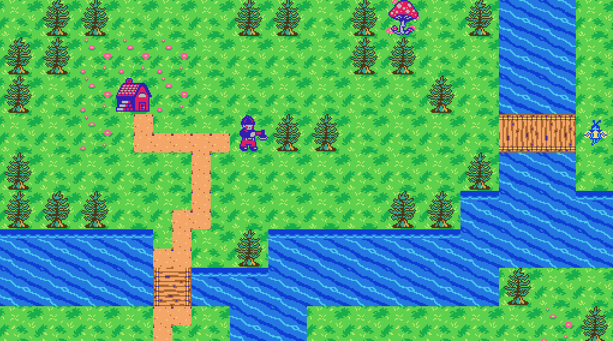

# Virtual World

## Overview

This project is a 2D virtual world featuring pixel-based entities with diverse behaviors and animations. 
Entities fall into four categories: those that perform animations, those that exhibit behaviors, those that do both, and those that do neither. 
The world is dynamic, with entities interacting based on predefined logic, movement patterns, and transformations. 
The implementation focuses on object-oriented design, pathfinding, and event-driven updates to create an engaging simulation.

## How to Play

### Controls

* Arrow keys - Move around the world.
* Right Click - Trigger a "world-changing event."

### Game Mechanics 
* Dudes chop trees and transport resources to the lumberhouse.
* Fairies revive the forest by transforming stumps into saplings.
* The forest grows dynamically over time, with trees and mushrooms spreading naturally.

## Installation

1. Install IntelliJ IDEA Ultimate or any other code editor that supports Java (the community edition of IntelliJ also works fine).

2. Copy link for Github repository
`https://github.com/alyssagerardo/virtual-world.git`

3. Clone repository into desired directory from terminal 
 `git clone https://github.com/alyssagerardo/virtual-world.git`

4. Open code editor and create new project by opening "virtual-world" file 

## Feature Images
